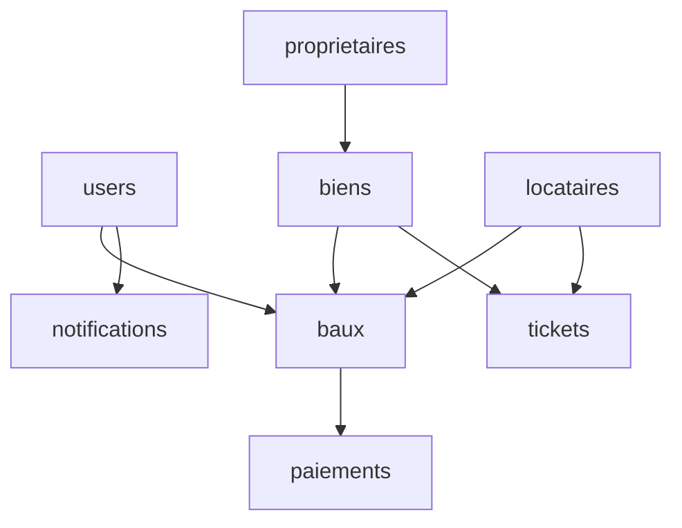

# 📊 Schéma de Base de Données - Hope Gestion Immobilière

## 🎯 Vue d'ensemble

La base de données de Hope Gestion Immobilière est composée de 8 tables principales qui stockent toutes les informations nécessaires à la gestion immobilière. Ces tables sont conçues pour fonctionner avec l'API RESTful Table intégrée.

---

## 📋 Tables de la Base de Données

### 1. 🧑‍💼 `users` - Utilisateurs de la plateforme (9 champs)

Stocke les informations des utilisateurs de la plateforme avec leurs rôles et identifiants de connexion.

| Champ | Type | Description |
|-------|------|-------------|
| id | string/number | Identifiant unique de l'utilisateur |
| email | string | Adresse email (unique, utilisé pour la connexion) |
| password | string | Mot de passe encodé |
| nom | string | Nom de famille de l'utilisateur |
| prenom | string | Prénom de l'utilisateur |
| telephone | string | Numéro de téléphone |
| role | string | Rôle dans la plateforme (admin, gestionnaire, locataire) |
| actif | boolean | Statut du compte (actif/inactif) |
| created_at | datetime | Date de création du compte |

---

### 2. 👔 `proprietaires` - Propriétaires immobiliers (8 champs)

Contient les informations légales et de contact des propriétaires immobiliers.

| Champ | Type | Description |
|-------|------|-------------|
| id | string/number | Identifiant unique du propriétaire |
| nom | string | Nom/Raison sociale du propriétaire |
| type | string | Type de propriétaire (personne physique/morale) |
| ifu | string | Numéro IFU (Identifiant Fiscal Unique béninois) |
| telephone | string | Numéro de téléphone |
| email | string | Adresse email |
| adresse | string | Adresse postale |
| nombre_biens | number | Nombre de biens possédés |

---

### 3. 🏢 `biens` - Biens immobiliers (15 champs)

Stocke les caractéristiques détaillées des biens immobiliers avec leurs loyers, statuts et équipements.

| Champ | Type | Description |
|-------|------|-------------|
| id | string/number | Identifiant unique du bien |
| reference | string | Référence unique du bien |
| proprietaire_id | string/number | Référence au propriétaire |
| type_bien | string | Type de bien (Appartement, Villa, Bureau, etc.) |
| adresse | string | Adresse physique du bien |
| ville | string | Ville du bien (Cotonou, Porto-Novo, etc.) |
| superficie | number | Superficie en m² |
| nombre_pieces | number | Nombre de pièces |
| loyer_mensuel | number | Loyer mensuel en FCFA |
| caution | number | Montant de la caution en FCFA |
| statut | string | Statut du bien (Disponible, Occupé, En maintenance) |
| equipements | array/string | Liste des équipements |
| photos | array/string | URLs des photos du bien |
| description | text | Description détaillée du bien |
| created_at | datetime | Date de création de la fiche |

---

### 4. 👥 `locataires` - Locataires (12 champs)

Contient les profils complets des locataires avec leurs informations de contact et statut.

| Champ | Type | Description |
|-------|------|-------------|
| id | string/number | Identifiant unique du locataire |
| nom | string | Nom de famille du locataire |
| prenom | string | Prénom du locataire |
| date_naissance | date | Date de naissance |
| lieu_naissance | string | Lieu de naissance |
| cni | string | Numéro de la Carte Nationale d'Identité |
| profession | string | Profession du locataire |
| employeur | string | Nom de l'employeur |
| telephone | string | Numéro de téléphone |
| email | string | Adresse email |
| contact_urgence | string | Contact en cas d'urgence |
| statut | string | Statut (Actif, Inactif, En attente) |

---

### 5. 📄 `baux` - Contrats de location (13 champs)

Gère les contrats de location avec leurs durées, montants et conditions.

| Champ | Type | Description |
|-------|------|-------------|
| id | string/number | Identifiant unique du bail |
| reference | string | Référence du contrat |
| bien_id | string/number | Référence au bien loué |
| locataire_id | string/number | Référence au locataire |
| date_debut | date | Date de début du bail |
| date_fin | date | Date de fin du bail |
| loyer_mensuel | number | Loyer mensuel en FCFA |
| caution | number | Montant de la caution en FCFA |
| frais_agence | number | Frais d'agence en FCFA |
| type_bail | string | Type de bail (Résidentiel, Commercial, Professionnel) |
| conditions | text | Conditions spéciales |
| statut | string | Statut (Actif, Expiré, Résilié) |
| created_at | datetime | Date de création du contrat |

---

### 6. 💰 `paiements` - Transactions (12 champs)

Enregistre tous les paiements avec leur méthode, statut et historique.

| Champ | Type | Description |
|-------|------|-------------|
| id | string/number | Identifiant unique du paiement |
| reference | string | Référence de la transaction |
| bail_id | string/number | Référence au bail concerné |
| locataire_id | string/number | Référence au locataire |
| montant | number | Montant en FCFA |
| mois_concerne | string | Mois concerné (format YYYY-MM) |
| date_paiement | date | Date du paiement |
| methode_paiement | string | Méthode (Mobile Money, Espèces, Virement, Chèque) |
| operateur_mobile | string | Opérateur Mobile Money (MTN, Moov) |
| numero_transaction | string | Numéro de transaction |
| type_paiement | string | Type (Loyer, Caution, Frais d'agence, Charges, Pénalités) |
| statut | string | Statut (En attente, Validé, Rejeté, Remboursé) |

---

### 7. 🎫 `tickets` - Système de maintenance (14 champs)

Gère les plaintes et demandes de maintenance avec leur workflow et priorité.

| Champ | Type | Description |
|-------|------|-------------|
| id | string/number | Identifiant unique du ticket |
| reference | string | Référence du ticket |
| bail_id | string/number | Référence au bail concerné |
| bien_id | string/number | Référence au bien concerné |
| locataire_id | string/number | Référence au locataire |
| titre | string | Titre du ticket |
| description | text | Description détaillée du problème |
| categorie | string | Catégorie (Plomberie, Électricité, Menuiserie, etc.) |
| priorite | string | Priorité (Faible, Moyenne, Haute, Urgente) |
| statut | string | Statut (Ouvert, En cours, Résolu, Fermé) |
| technicien_assigne | string | Technicien assigné à la réparation |
| cout_reparation | number | Coût de la réparation en FCFA |
| photos | array/string | URLs des photos du problème |
| date_creation | datetime | Date de création du ticket |

---

### 8. 🔔 `notifications` - Système de notifications (7 champs)

Stocke les notifications envoyées aux utilisateurs avec leur statut de lecture.

| Champ | Type | Description |
|-------|------|-------------|
| id | string/number | Identifiant unique de la notification |
| utilisateur_id | string/number | Référence à l'utilisateur destinataire |
| titre | string | Titre de la notification |
| message | text | Contenu de la notification |
| type | string | Type (Paiement, Ticket, Bail, Système) |
| lu | boolean | Statut de lecture (lu/non lu) |
| created_at | datetime | Date de création de la notification |

---

## 🔗 Relations entre les Tables

## 📈 Statistiques

- **Nombre total de tables** : 8
- **Nombre total de champs** : 86
- **Clés étrangères** : 12+

## 🛠️ API RESTful

L'application utilise une API RESTful Table avec les endpoints suivants :

- `GET /tables/{table}` - Liste avec pagination
- `GET /tables/{table}/{id}` - Détail d'un enregistrement
- `POST /tables/{table}` - Création
- `PUT /tables/{table}/{id}` - Mise à jour complète
- `PATCH /tables/{table}/{id}` - Mise à jour partielle
- `DELETE /tables/{table}/{id}` - Suppression

*Dernière mise à jour : Décembre 2025*
*Version : 1.0.0 (MVP)*